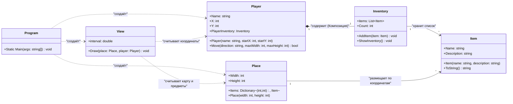

```mermaid
classDiagram
    direction LR

    class Program {
        +Static Main(args: string[]) void
    }

    class Player {
        +Name: string
        +X: int
        +Y: int
        +PlayerInventory: Inventory
        +Player(name: string, startX: int, startY: int)
        +Move(direction: string, maxWidth: int, maxHeight: int) bool
    }

    class Inventory {
        +items: List~Item~
        +Count: int
        +AddItem(item: Item) void
        +ShowInventory() void
    }

    class Item {
        +Name: string
        +Description: string
        +Item(name: string, description: string)
        +ToString() string
    }

    class Place {
        +Width: int
        +Height: int
        +Items: Dictionary~(int,int), Item~
        +Place(width: int, height: int)
    }

    class View {
        +interval: double
        +Draw(place: Place, player: Player) void
    }

    %% Отношения и связи между классами
    Program ..> Player : "создаёт"
    Program ..> Place : "создаёт"
    Program ..> View : "создаёт"
    
    Player "1" *-- "1" Inventory : "содержит (Композиция)"
    Inventory "1" --> "*" Item : "хранит список"
    Place "1" --> "*" Item : "размещает по координатам"
    
    View ..> Player : "считывает координаты"
    View ..> Place : "считывает карту и предметы"
```